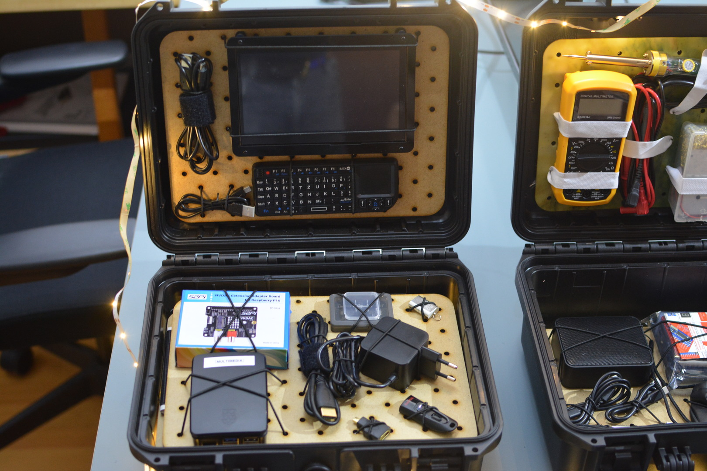
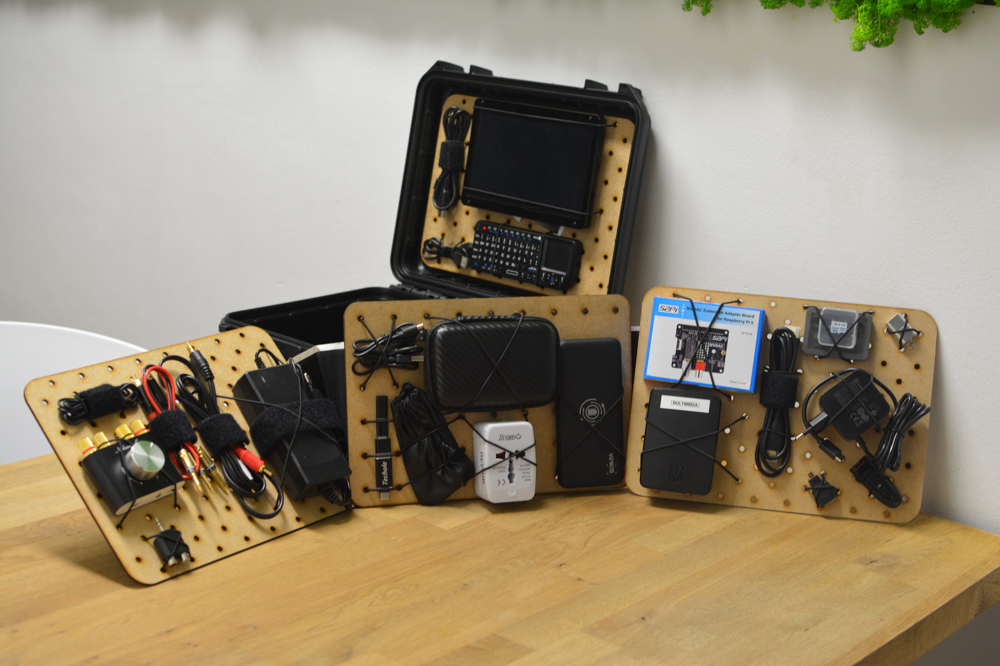

# Training Kit: Multimedia - Hub

## Description

This powerful Training Kit is designed to serve multiply digital literacy trainings as well as setting up a running multimedia center with open source software and a simple Raspberry Pi. This can run local media resources (primary Video, Audio, Images, can be extended with add-ons) but also setup for external internet radio, TV, Podcasting and other streaming media to play from. This can also for advanced users run a small internet Radio station (needs investigation).

## Modules included

**Modules (Layer 1-4)**

- Module [M007](../MODULES/M007.md): Media Controls
- Module [M008](../MODULES/M008.md): Media Center
- Module [M009](../MODULES/M009.md): Audio Extras
- Module [M010](../MODULES/M010.md): Media Accessories

## Assembly Notes

For the Setup, please also follow the [Software](../Software/README.md) instructions.

The Kit is assembled in a way, one can attach the modules together with hook-and-loop parts so each module can be fixed to each other or to the lid (though the controls/screen module makes most sense on top). It Unfolds for easy (un)packing. 

`Multimedia-Hub: spread out on table (raw packing setup without shadow-board)`