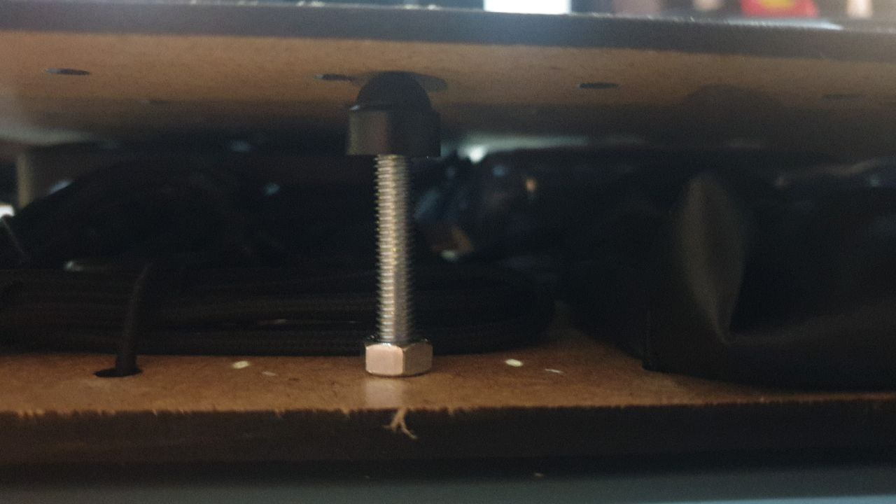

# Training Kits

## Repair - Basic Tools

**Modules (Layer 1-4)**

- Module [M001](../MODULES/M001.md): Basic Essentials
- Module [M002](../MODULES/M002.md): Basic Soldering Tools
- Module [M003](../MODULES/M003.md): Basic Mobile Repair Tools
- Module [M004](../MODULES/M004.md): Basic Mechanical Tools

## Radio - DIY

**Modules (Layer 1-3)**

- Module [M002](../MODULES/M002.md): Basic Soldering Tools
- Module [M005](../MODULES/M005.md): FM Radio Basics
- (optional) Module [M006](../MODULES/M006.md): Radio Assembly Extras

## Multimedia - Hub

**Modules (Layer 1-4)**

- Module [M007](../MODULES/M007.md): Media Controls
- Module [M008](../MODULES/M008.md): Media Center
- Module [M009](../MODULES/M009.md): Audio Extras
- Module [M010](../MODULES/M010.md): Media Accessories

## General Assembly Instructions

1. **Take a Max300 Box/Case**
---
2. Take the quantity of layer boards needed per kit (see [CAD Section](CAD) for instructions)
---
3. Prepare all items and required rubber bands
---
4. Glue a printout DIN A4 sheet of paper on top of the board, make sure it aligns well
---
5. (manual step if needed) Take a white sheet of DIN A4 paper and draw a line around all Items. Mark the holes for the rubber fixing points. Scan and create reference SVG/Vector image. Adjust to needs and documentation. Print out and glue on top of the board (glue stick works fine)
---
6. (manual step if needed) Label all items according to their module item list/description (on a predefined layer/module printout it is included in the SVG)
---
7. Color mark the case and related modules
---
8. Double check all fixation points and punch holes to feed the rubber ends through
---
9.  Position all items according to Module instructions
---
10. (optional) add corner/distance elements if needed
---
11. Add software/digital material
---
12. Print out all relevant Module sheets/documentation + Kit documentation if present/needed
---
13. Label the Case according to Training Scenario
---
14. (optional) Help with documentation and share impressions online if you want to support this project

## Types of Packing:

Things we considered for the project:
1. Sustainable material
2. Easy to replicate (around the globe)
3. durable and versatile
4. DIN A4 reference (create/design your own layer)

[Style Guide will follow soon] - for now: simply take a sheet of DIN A4 paper (letter format should work too), place all Items, take a photo, mark all shadow lines and define what packing type you want to use.

We have tested the following options successfully

### Rubber Band thin
> classic, looks elegant/professional, easy to mount, current choice for replication!

`Tip 1: use a crimping tool to fix T-Splints to rubber band`

`Tip 2: make the rubber band as long as the distance you want to bridge

### Rubber Band thick
> easy to replicate around the world, tighter fit. Looks a bit more DIY. Easy to fix/replace.

`Tip: you should pick black color, this was just a test. Use a stapler 2x to fix the ends and burn off the ends with a lighter`

### Cut-Out Cardboard Layers
> can be replicated around the world with used cardboard, takes a lot of time but would also work with other CNC/Laser cut material (needs testing). Wears off over time and items become loose. [more investigation/testing needed]

`original packing design, classic but has downsides, needs further material testing.`

## Additional Packing Notes

- We are currently using hook and loop tape to connect and fix layers to the lid. 
- This connection method can also be developed further with magnets, rubber band/textile or even 3D Printed parts
- Make sure to clean surfaces you want to glue to
- For corner pieces/bumpers there is no solution yet that works out of the box, feel free to suggest anything that makes the stack of modules in a kit even more robust/fit
- The 32x32mm is the base grid you can read about it in the [CAD README](../CAD/README.md)
- For the distance between layers to be defined and flat here are a few options we tested (undecided):

`base pin distance holder for 3D printing`

`screw and nuts for distance holder option`

