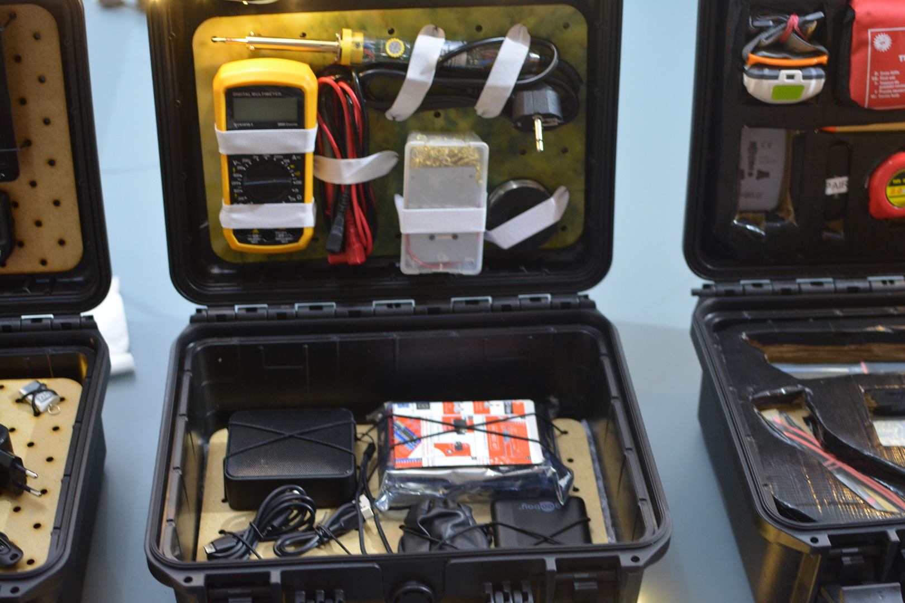

# Training Kits

## Repair - Basic Tools

**Modules (Layer 1-4)**

- Module [M001](M001.md): Basic Essentials
- Module M002: Basic Soldering Tools
- Module M003: Basic Mobile Repair Tools
- Module M004: Basic Mechanical Tools

## Radio - DIY

**Modules (Layer 1-3)**

- Module M002: Basic Soldering Tools
- Module M005: FM Radio Basics
- (optional) Module M006: Radio Assembly

## Multimedia - Hub

**Modules (Layer 1-4)**

- Module M007: Media Controls
- Module M008: Media Center
- Module M009: Audio Extras
- Module M010: Media Accessories

## General Assembly Instructions

1. Take a Max300 Box
2. Take the quantity of layer boards needed per kit (see [CAD Section](CAD) for instructions)
3. Prepare all items and required rubber bands
4. Glue a printout DIN A4 sheet of paper on top of the board, make sure it aligns well
5. (manual step if needed) Take a white sheet of DIN A4 paper and draw a line around all Items. Mark the holes for the rubber fixing points. Scan and create reference SVG/Vector image. Adjust to needs and documentation. Print out and glue on top of the board (glue stick works fine)
6. (manual step if needed) Label all items according to their module item list/description (on a predefined layer/module printout it is included in the SVG)
7. Color mark the case and related modules
8. Double check all fixation points and punch holes to feed the rubber ends through
9. Position all items
10. (optional) add corner/distance elements if needed
11. Add software/digital material
12. Print out all relevant Module sheets/documentation + Kit documentation if present/needed
13. Label the Case 
14. (optional) Help with documentation and share impressions online if you want to support this project