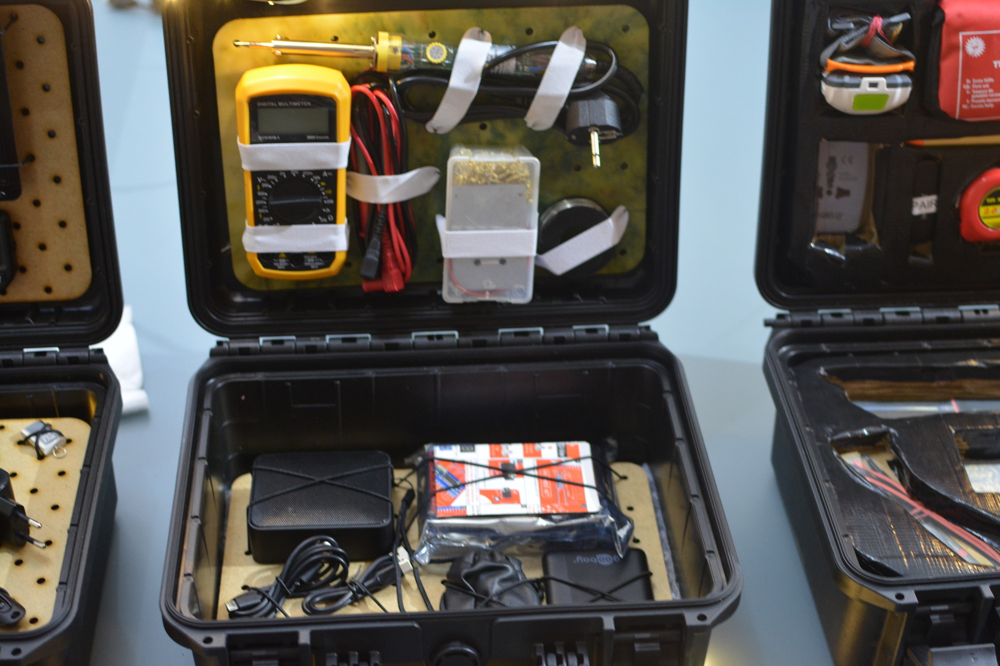

# Training Kit: Radio - DIY

## Description
This kit is essentially the first FM receiver self build experience kit, you can learn soldering along the way. A trainer can showcase DIY Radio as well as simple basics about receiving radio signals and how a radio is made. Accessories help facilitate the topic.

## Modules included

**Modules (Layer 1-3)**

- Module [M002](../MODULES/M002.md): Basic Soldering Tools
- Module [M005](../MODULES/M005.md): FM Radio Basics
- (optional) Module [M006](../MODULES/M006.md): Radio Assembly Extras

## Assembly Notes

This kit can be extended with Module M006 containing additional Radio DIY sets (4 recommended for training).