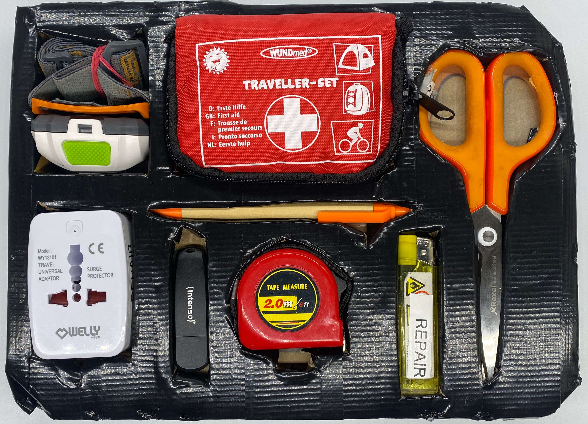

# Module M001: Basic Essentials

## Description
This Module is a general layer that helps for first aid, daily helpers such as scissors, pen, lighter, headlight and something to measure. The USB Flash drive can be filled with all relevant info or offline tipps e.g. for Repair Guides or general help like the [Open Guides](https://github.com/opencultureagency?q=open+guide&type=all&language=&sort=name).

## Item List
- 1x Headlamp
- T1x ravel Adaptor (international Multi-Plug)
- 1x First Aid Kit + Ointment Gel
- 1x Scissors
- 1x Pen
- 1x Measure tape
- 1x Lighter 
- 1x USB Flash drive 32-64GB

## Packing Notes

You might consider preparing the USB Flash drive with useful training material. Also software to carry or a linux image to run a live system from.

If needed additionally to the first aid kit you might want to add disinfectant spray. (originated from the [#ASKotec](https://github.com/opencultureagency/ASKotec) kit)