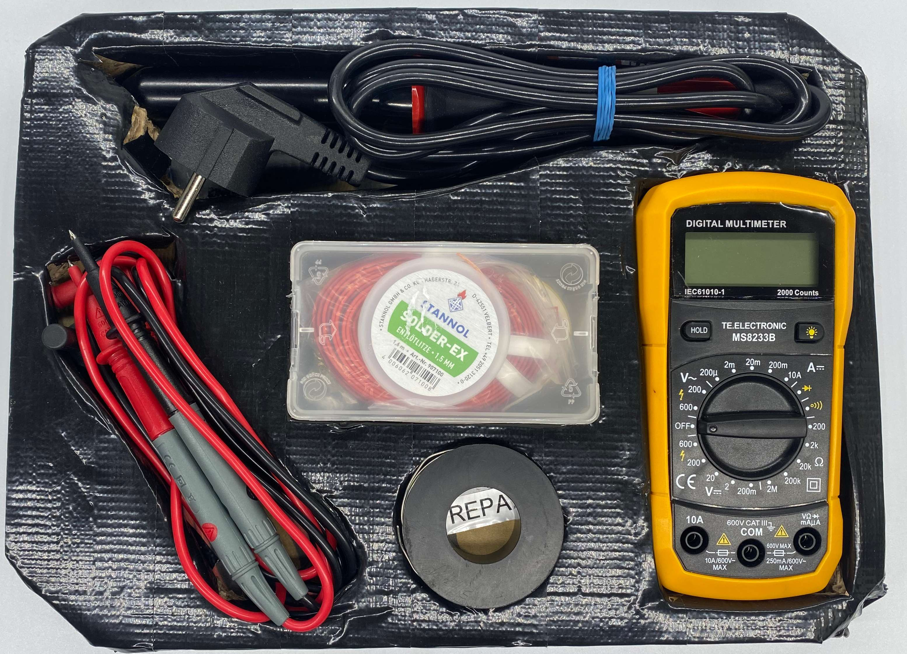
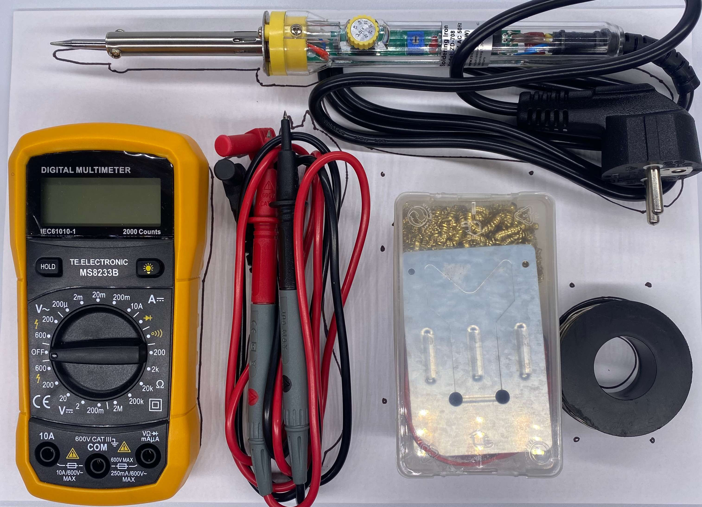
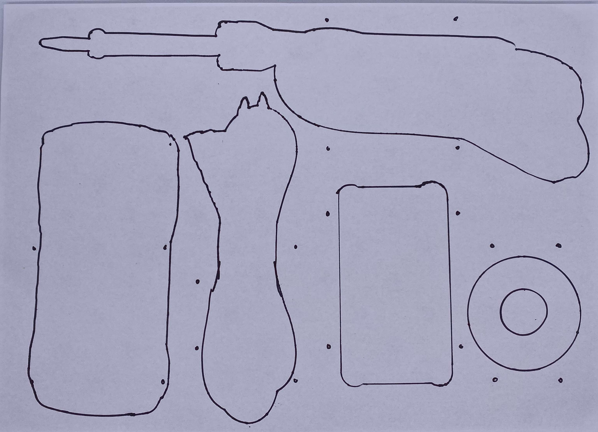

# Module M002: Basic Soldering Tools

`initial packing design`

## Description
The basic soldering tools are available to all simple soldering tasks, fixing connections, repairing old soldering parts and measuring all general data from a multimeter. It includes also essential material (twin wire, solder, solder remover etc.) for ready to solder situations that need to be refilled after time.

## Item List
- 1x Soldering Iron
- 1x Multimeter
- 1x Multimeter cables
- 1x Solder wire
- 1x Assortment box with soldering essentials
  - 2x solder remover, solder grease, stand, twin wire

## Packing Notes
Currently the old packing design is used by the ["Repair - Basic Tools"](../KITS/Repair%20-%20Basic%20Tools.md) Kit.

The new packing design e.g. is used for the ["Radio - DIY"](../KITS/Radio%20-%20DIY.md) Kit:

`new packing design`

`new template for packing on a Grid Base Plate` 