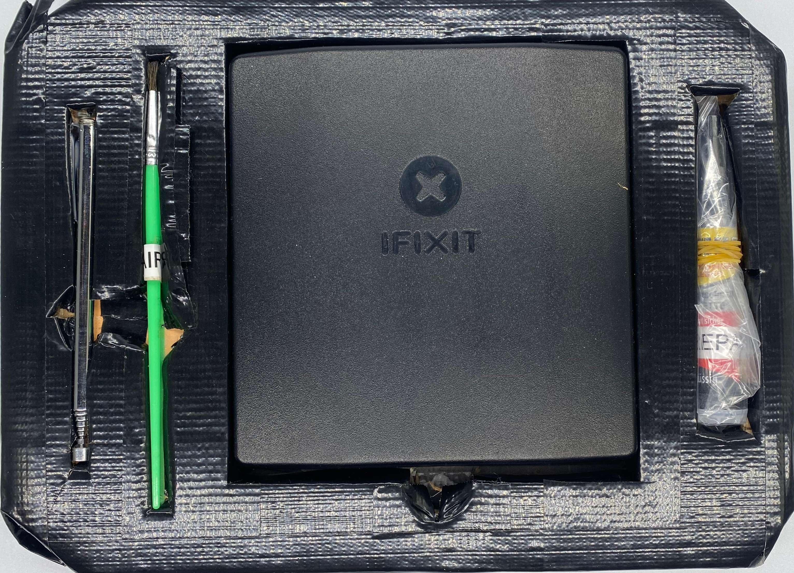
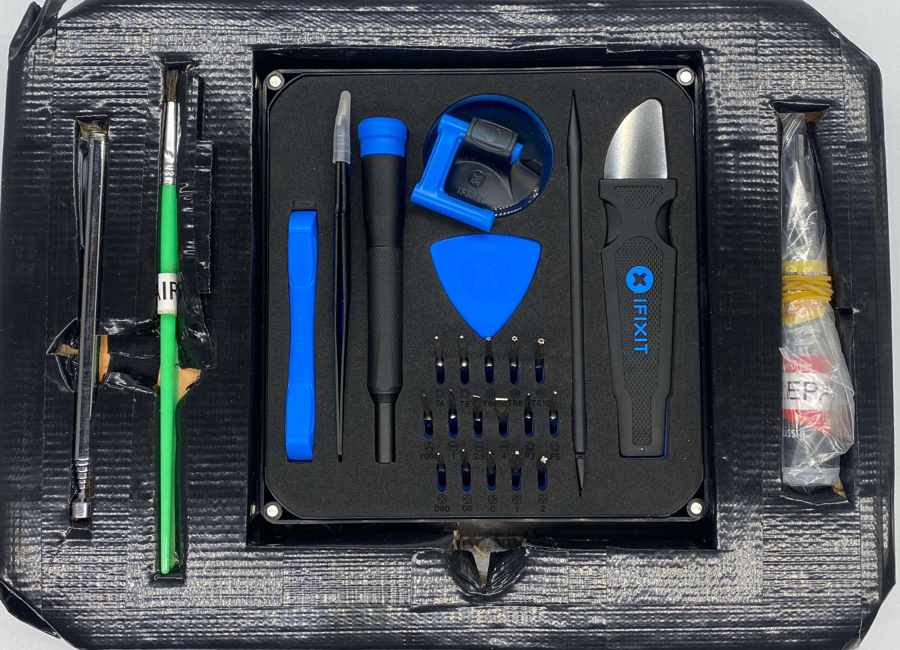

# Module M003: Basic Mobile Repair Tools 

## Description
This module aims to facilitate most repairs of phones, Laptops and other smaller mobile devices. Get screws out of difficult places and brush away small particles or glue back on loose parts.

## Item List

- 1x telescopic magnet tool
- 1x small brush
- 1x Essential Electronics Toolkit (iFixit)
- 1x super glue

## Packing Notes

`look inside the essential electronic toolkit from iFixit`
