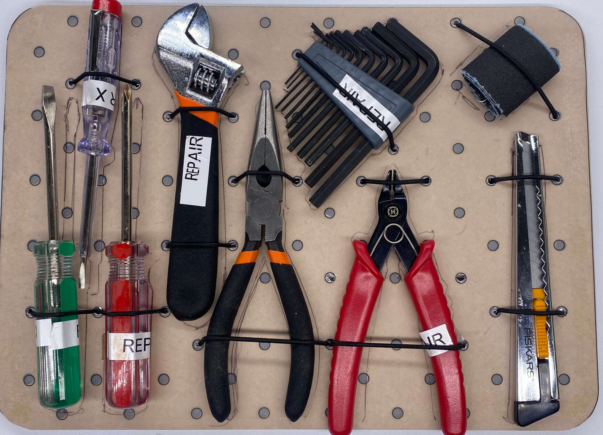

# Module M004: Basic Mechanical Tools

## Description
This basic mechanical tool set is down to the very minimum needed to repair all kinds of devices and have a set of emergency tools at hand to solve simple mechanical challenges.

## Item List
- 1x adjustable wrench
- 1x cutter
- 1x set of allen keys
- 1x pointed pliers
- 1x wire clipper
- 1x cross head screwdriver
- 1x flat head screwdriver
- 1x small flat hat screwdriver with power line tester
- 1x small piece of sandpaper

## Packing Notes
This Module is currently packed in the old style of layered cardboard cut-outs.

A new attempt of packing this can be seen here:

 
`new Grid Base Plate packing design`
