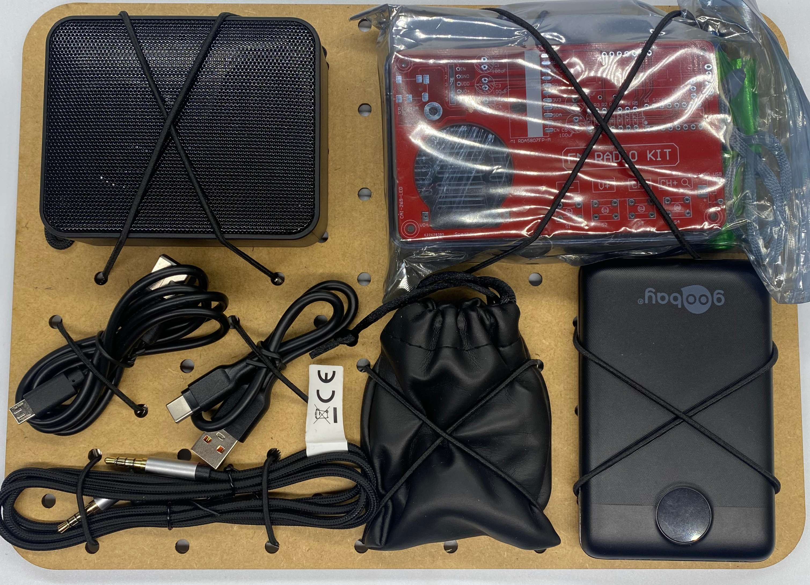

# Module M005: FM Radio Basics

## Description

This module is a powerful demonstration setup to assemble a simple DIY FM Radio as a soldering experience and teaching how a radio is build. This module requires soldering tools when first used. The additional items can be used to power the radio via speaker, headphone or additional power source. It can even be connected via AUX cable. 

## Item List
- 1x DIY FM Radio Assembly set + 3xAAA rechargeable batteries
- 1x small speaker with AUX and Bluetooth function
- 1x micro USB cable
- 1x USB-C cable
- 1x 3.5mm AUX cable
- 1x Headphones in bag
- 1x Power Pack 10Ah with USB-A and USB-C connection

## Packing Notes

- The 3x AAA rechargeable batteries need to be places inside the plastic bag of the Radio kit, also make sure a small cross-head screwdriver is present

[image template]