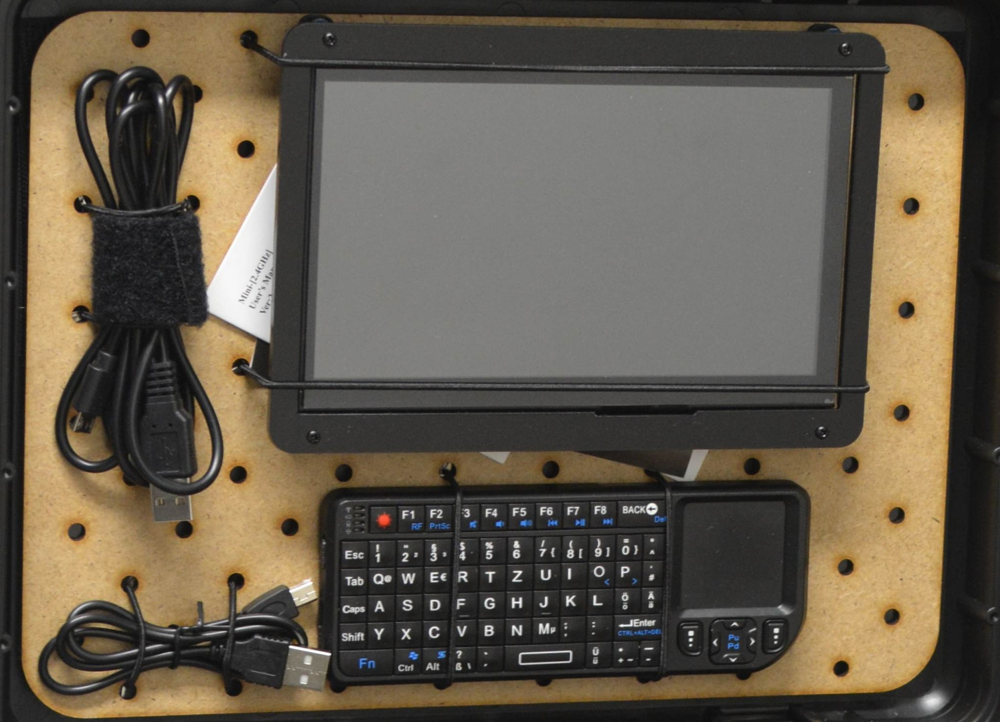
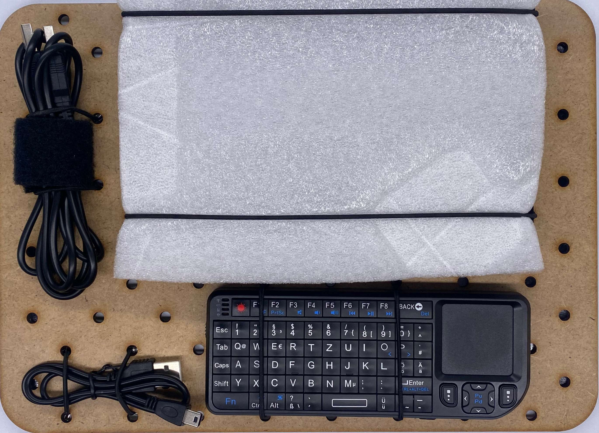
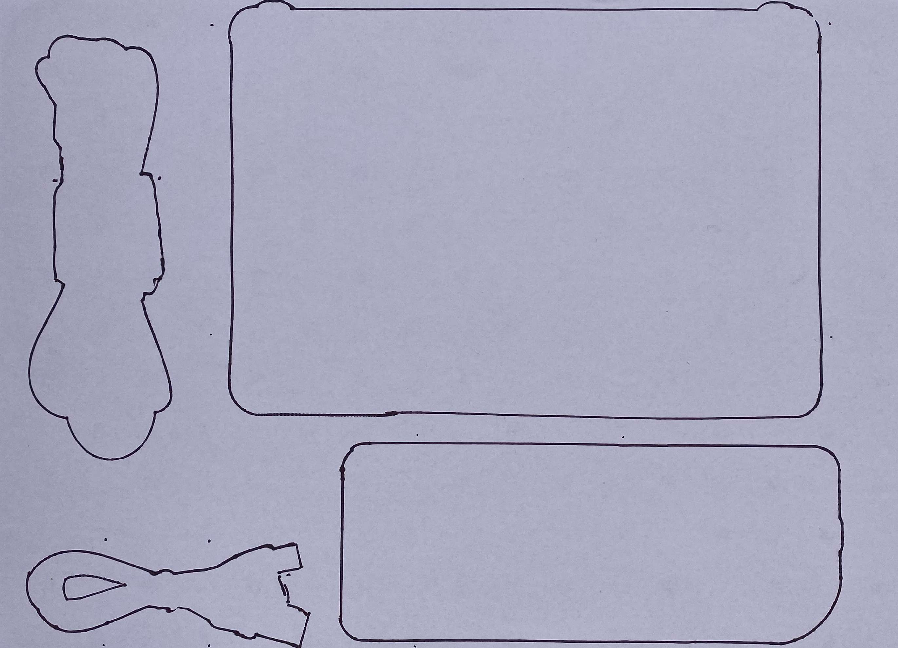

# Module M007: Media Controls

## Description

Basic Media controls for managing input and output e.g. for Raspberry Pi SBC and the [Multimedia - Hub](../KITS/Multimedia%20-%20Hub.md) training kit. Can run on 5V Power.

## Item List

- 1x micro to 2x USB A cable
- 1x 7inch Touch Screen
  - +instruction manuals
- 1x mini USB cable
- 1x mini Keyboard

## Packing Notes
The Screen is fixt with its frame screws in two holes on the bottom side to holt it in place, should still be attached with 2 Rubber fixing bands.

**It is relevant to mention the extra protection is a MUST for the screen to keep the touch function intact and avoid scratches!**

`protection foam layer for screen`

`packing template`

