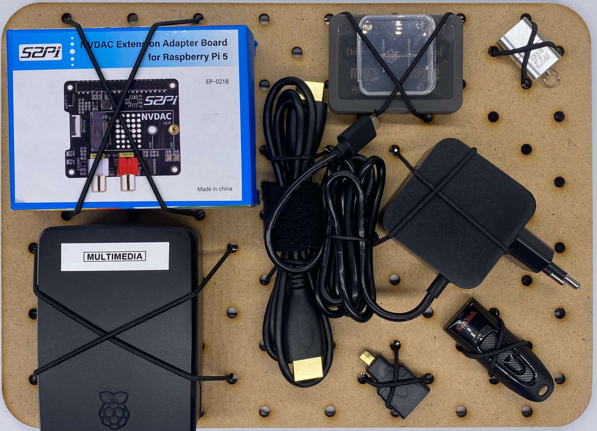
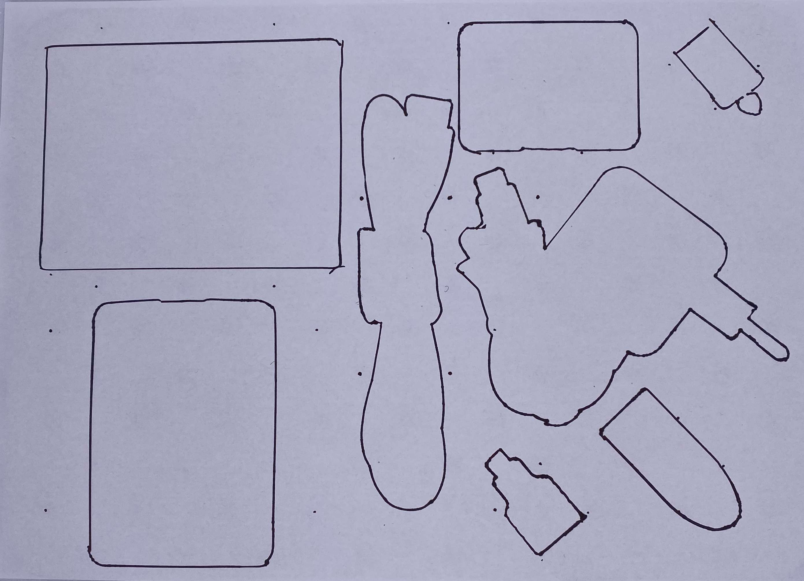

# Module M008: Media Center

## Description

This Module is the main media center and computer hardware set containing all elements to run a Linux operating system on a single board computer (SBC). The heart is the Raspberry Pi 5 but can be exchanged to a Raspberry Pi 4 (not recommended). Can run on 5V power.

## Item List
- 1x Audio and Storage HAT NVDAC Adapter for RPi5
- 1x SBC/Raspberry Pi 5 with Case + Fan & Adapterboard 
- 1x HDMI to HDMI cable
- 1x HDMI to micro HDMI Adapter
- 1x RPi5 Power Adapter USB-C
- 1x micro SD Card box with 4 SD cards (Operating Systems)
- 1x micro SD Card Reader
- 1x USB Flash Drive (32-64GB)
  - Software/Digital Media

## Packing Notes
- see [Software](../Software/) for additional setup notes of the media center with Kodi and other Operating System options 
- Media file management is organized via NVMe Storage on HAT (can optionally also be done via Micro SD Card, not recommended)

`packing template`