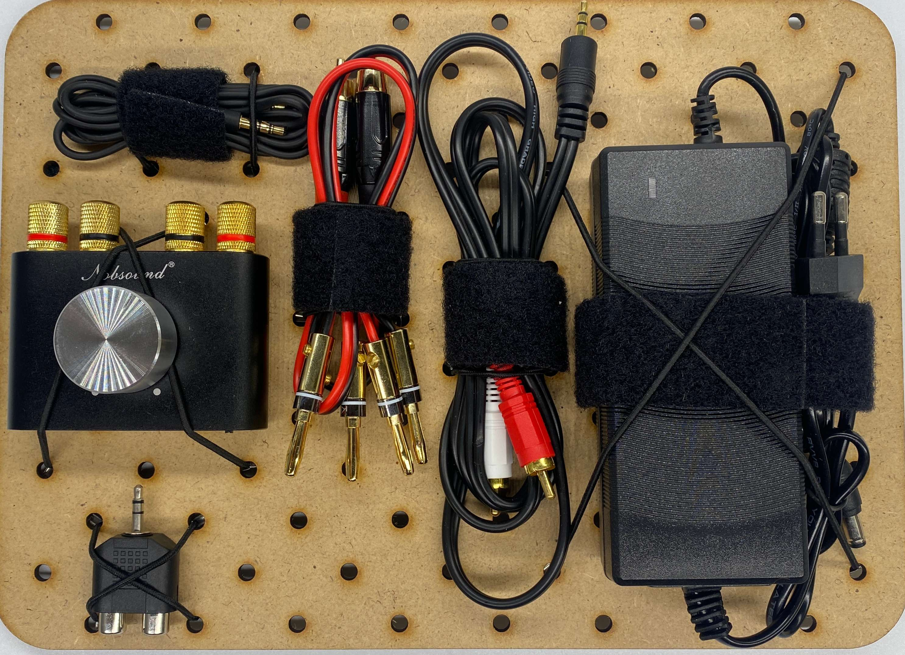
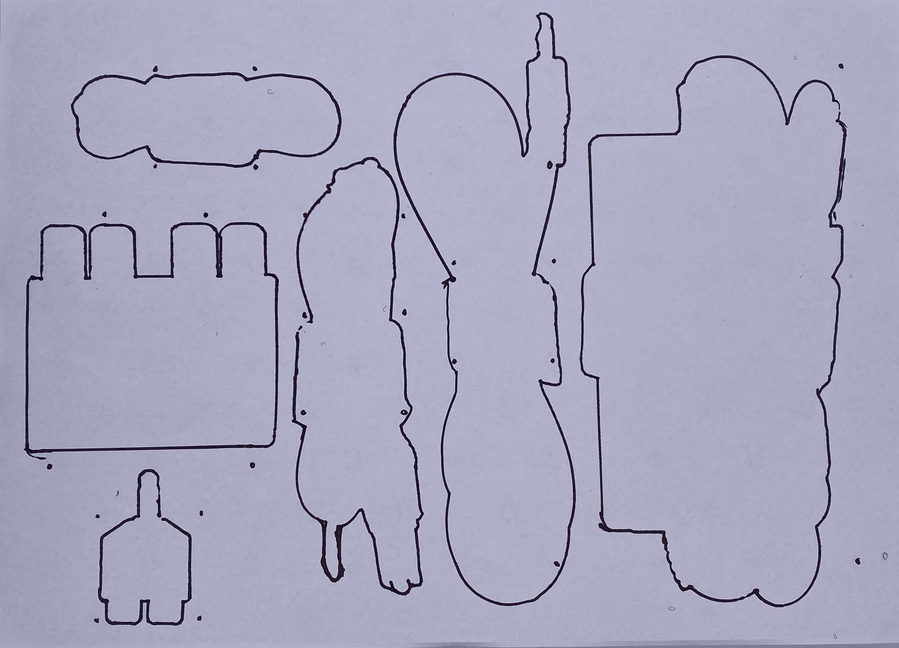

# Module M009: Audio Extras

## Description

All Audio Extras needed to power an external audio setup/speaker. Connect to to different input and output devices.

## Item List

- 1x Audio Amplifier with Bluetooth (Banana Keys, Aux, micro USB)
- 1x Power Cable for Amplifier
- 2x Banana (Adapter/Plugs) to RCA/Cinch Cable
- 1x RCA/Cinch to 3.5mm/AUX cable
- 1x RCA/Cinch (f) to 3.5mm/AUX adapter
- 1x 3.5 AUX2AUX cable

## Packing Notes

- The banana to cinch cable needs to be assembled as the cinch cable comes with twin wire only and the banana plugs need to be mounted separately.

`packing template`