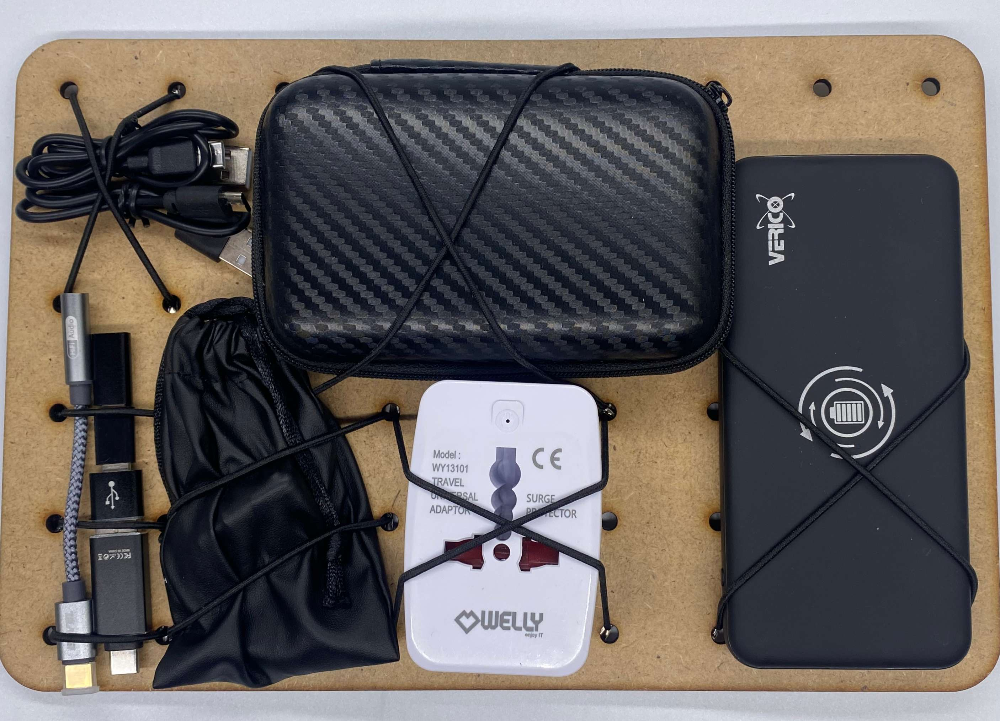
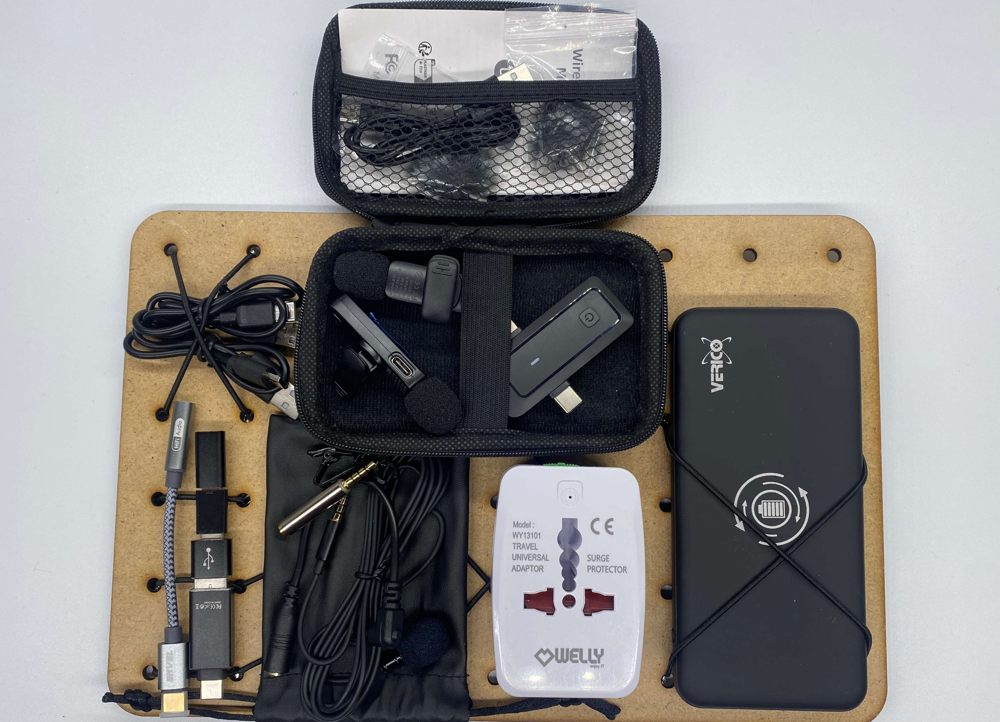
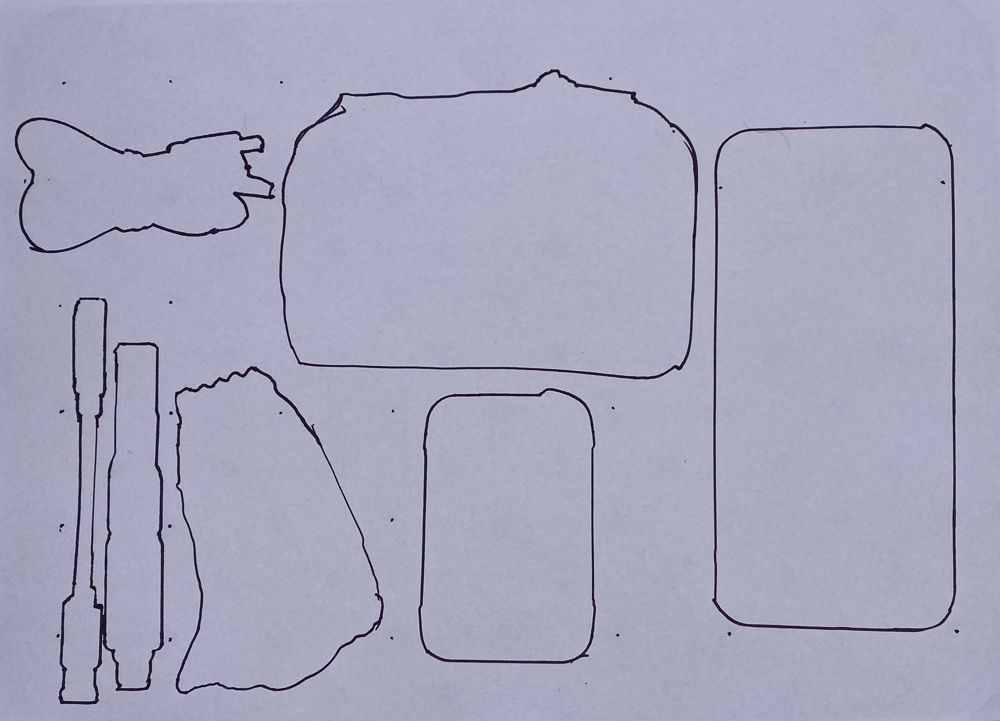

# Module M010: Media Accessories

## Description

Essential media accessories to power the digital devices (internationally), record audio and connect to all kinds of plugs/input types.

## Item List
- 4x multiple USB Adapter: C to micro - micro to C - C to A - A to C 
- 1x USB-C to AUX adapter
- 1x wired Lavalier Microphone in bag + Adapter
- 1x USB-A to micro USB cable
- 1x USB-A to USB-C cable
- 1x international multi-plug Travel Adapter
- 1x Power Bank 10Ah 2xUSB-A 1x USB-C and wireless charging
- 2x wireless mics and receiver + extras in case

## Packing Notes

The image shows all extra packing items in the set:

- wired Lavalier Microphone has multiple adapters for iPhone and other devices
- 2x wireless mics with extras (can connect to smartphones)
- (optional) add USB-C to AUX cable
- (optional) add USB-C to Lightening (iPhone)

`packing template`

