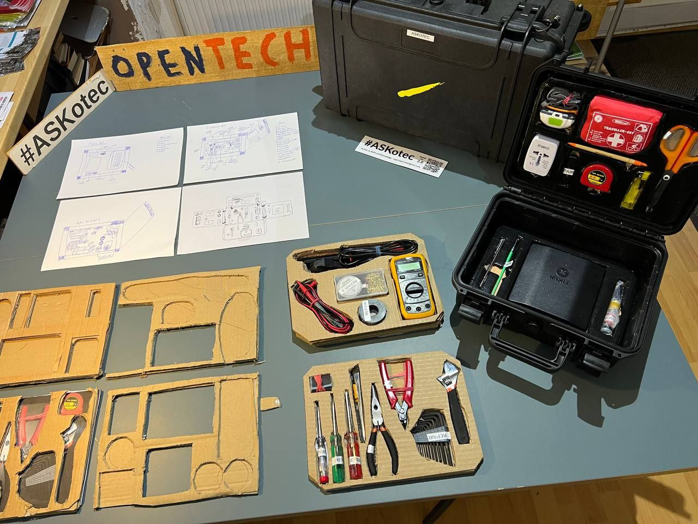
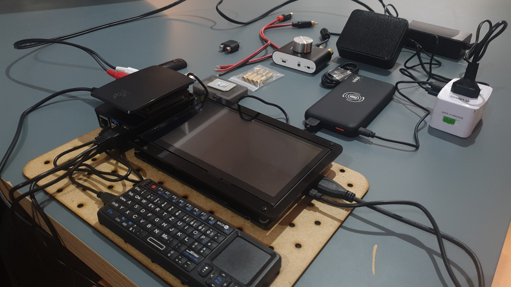
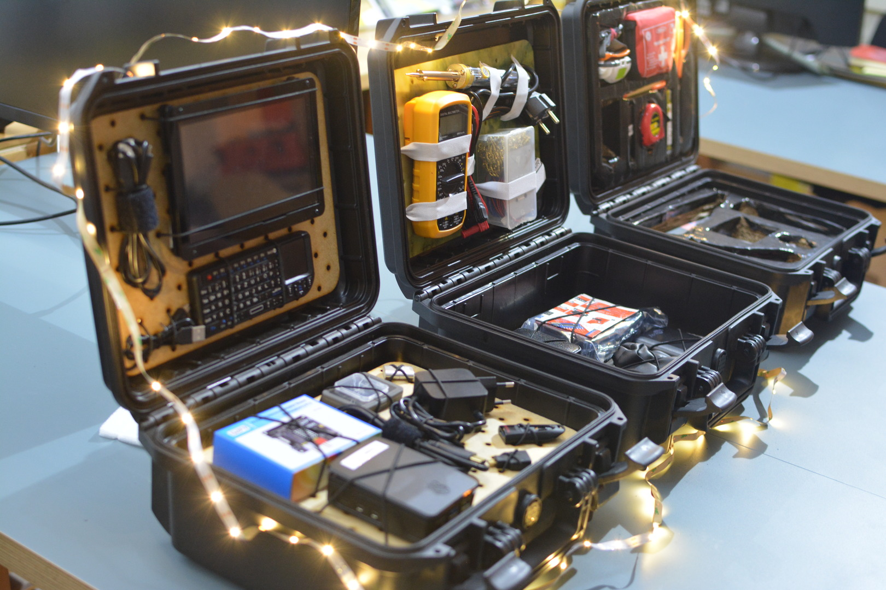
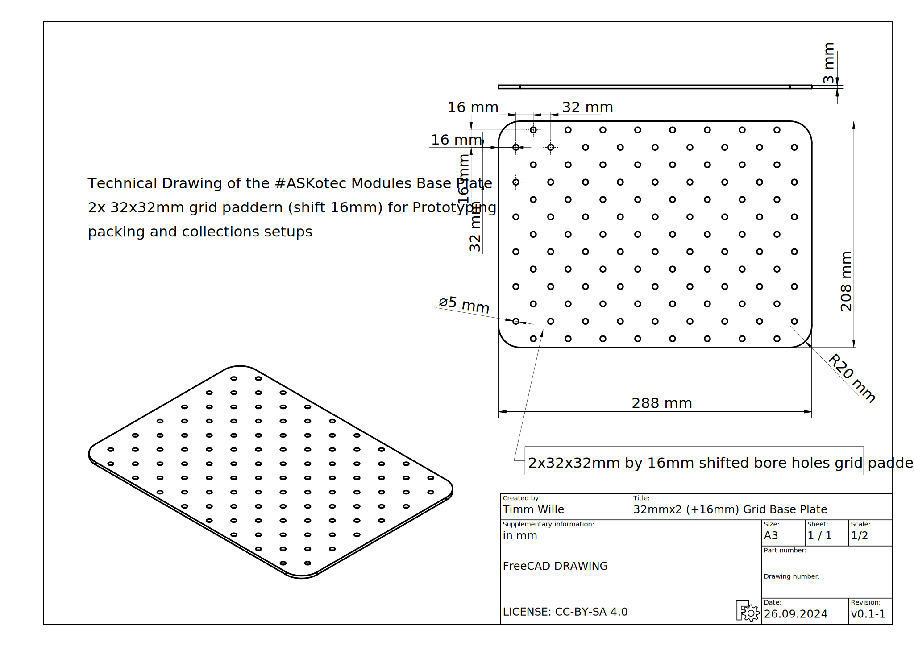

# #ASKotec inspired Modules

> A new generation of [#ASKotec](https://ASKotec.openculture.agency) inspired Training Kits with use-case specific layer options and a DIN A4 blueprint reference.

- If you have any suggestions, please make sure to file an [Issue](https://github.com/opencultureagency/ASKotec-Modules/issues)
- Feel free to Fork this Repository in Order to send in your own Module Designs or Additional Material to merge via [Pull Request](https://github.com/opencultureagency/ASKotec-Modules/pulls)
- Respect the Open Source [License Note below](README.md#license-references)

`image 1: repair tools kit in the making`

`image 2: multimedia kit in the making`

`image 3: first 3 training kits ready`

## ToDo
- [x] Design a Concept
- [x] Upload Grid Base Plate for prototyping
- [x] Build first Prototype for Repair
- [x] Build First Prototype for Radio
- [x] Build first Prototype for Multimedia
- [x] Provide Meta Instructions on all Training Kits
- [x] Double Check Folder/File Structure
- [x] Double Check CAD Versioning vs. Repo Versioning
- [ ] Upload Spreadsheet for available Kit-BOMs (Item List Collection)
- [ ] First official Release 1.0 (Repair, Radio, Multimedia)
- [ ] Build first Prototype for Solar & more ...

# Training Kits

## Repair - Basic Tools

**Modules (Layer 1-4)**

[Training Kit Manual](/KITS/Repair%20-%20Basic%20Tools.md)

## Radio - DIY

**Modules (Layer 1-3)**

[Training Kit Manual](/KITS/Radio%20-%20DIY.md)

## Multimedia - Hub

**Modules (Layer 1-4)**

[Training Kit Manual](/KITS/Multimedia%20-%20Hub.md)

---

# Packing

More details via [CAD-README](CAD/README.md)

## Grid Base Plate

> Current CAD/2D Drawing designed in FreeCAD v0.21.2 using the workbenches `Part Design`, `Spreadsheet` and `TechDraw`.
>
> Designed to work in combination with a [MAX300](https://xenotec-shop.de/produkt/max300/) case (but can be adjusted/used in other forms/packings as well as it fits DIN A4 Paper format)
>
> Technical Specs of the Grid-Base-Plate see Drawing below:

- Reference Design will have 32mm+16mm Double Grid and R20 Corners currently
- Older variations can be found via [Archive](Archive/)
- [FreeCAD](CAD/Grid-Base-Plate/32-grid-Base-Plate+16mm.FCStd) Source Files and Exports in [PDF](CAD/Grid-Base-Plate/TechnicalDrawing+16mm.pdf) for reference, and [SVG](CAD/Grid-Base-Plate/Base-16grid-9x6+8x6+1+16mm_R20.svg), [DXF](CAD/Grid-Base-Plate/Base-16grid-9x6+8x6+1+16mm_R20.dxf) for manufacturing are available for Adoption/Scaling/Lasercutting etc.
- > Note: If you make adjustments and play around in the parameters (parametric Spreadsheed reference), in some cases you need to fix the TechDraw measurements

---

---

# Software

For some of the Kits (e.g. Multimedia - Hub) a software setup will be needed to complete the build. Those instructions and further details are available in the [Software/README.md](Software/README.md).

---

---

# LICENSE References

- **All Documentation** is Licensed as [CC-BY-SA 4.0](LICENSE_CC_BY_SA_4.0.md) and for further collaboration/integration all **Module CAD Designs** are also available under [CERN OHL W 2.0](CAD/LICENSE_cern_ohl_w_v2.txt). 
- (Future Software Packages might also Reference other compatible Licenses here as MIT, Apache or a respective GPL License)
- > Original Inspiration comes from [#ASKotec Main Repo](https://github.com/opencultureagency/ASKotec) under CC-BY-SA 4.0 (though this new design is developed from the ground up)